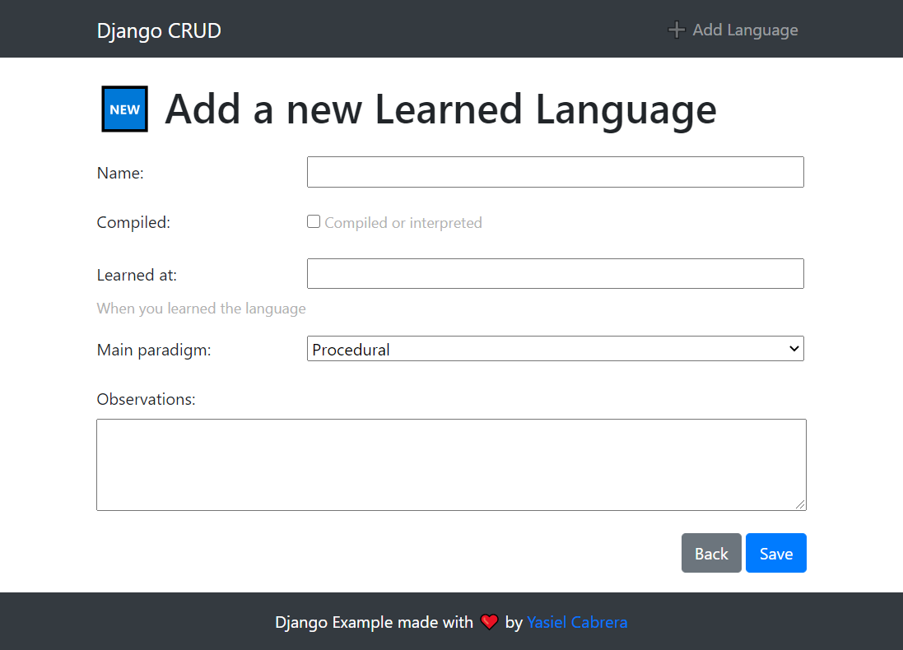
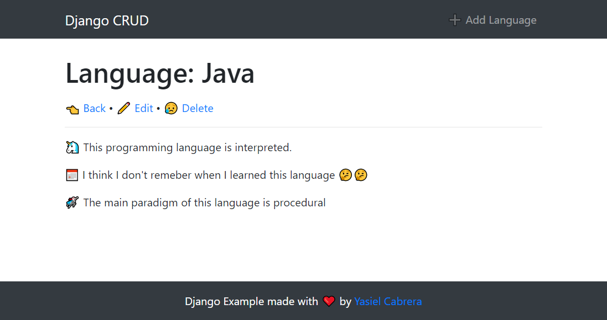
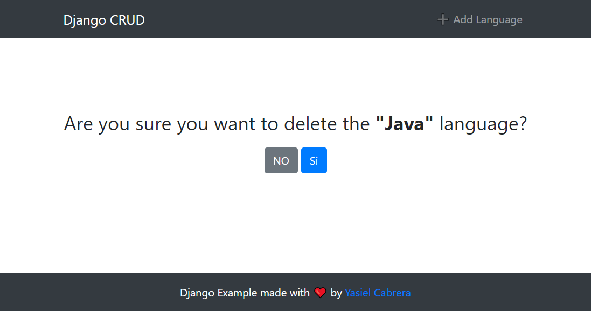

A simple example to help to understand how Generic Views works in Django.

## Pages

**Home Page:**


**Create and update Pages:**

(The pages for creating and updating look like the same)



**Details Page:**



**Delete confirmation Page:**



## installation

- Create a new virtual environment. If you don't know how to do it, you can learn [here](https://www.cabyas.com/virtualenv-python/)

- Install the requirements:

```
pip install -r requirements.txt
```

- run the migrations:

```
python manage.py migrate
```

- Run the develop server:
  
```
python manage.py runserver
```

